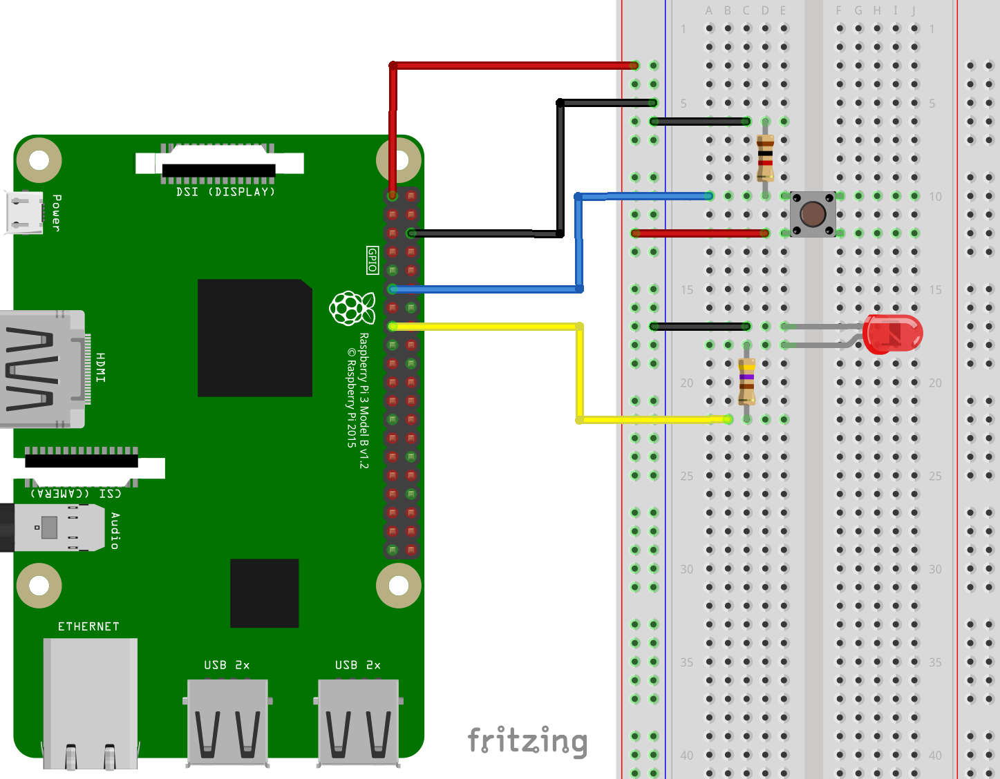

Google Assistant for Raspberry Pi 3
===============================================

Demo
----

.. image:: https://user-images.githubusercontent.com/17570265/30750609-e0fc4792-9ff1-11e7-93f8-cfdba1c9d7dc.png
    :target: https://www.youtube.com/watch?v=kjYlPxOtYY8

Prerequisites
-------------

- `Python <https://www.python.org/>`_ >= 3.4
- SBC with ``linux-arm7l`` (eg: Rasbperry Pi 3) or ``linux-x86`` architecture.
- A `Google API Console Project <https://console.developers.google.com>`_
- A `Google account <https://myaccount.google.com/>`_

Pin Assignment
-------------

======= ===========
PIN     Device
======= ===========
+3V3    -
GND     -
GPIO 17 Tact switch
GPIO 22 Red LED
======= ===========

Setup
-----

- Install Python 3 on RaspberryPi3 ::

    sudo apt-get update
    sudo apt-get install python3 python3-venv

- Create a new virtual environment (recommended)::

    python3 -m venv env
    env/bin/python -m pip install --upgrade pip setuptools
    source env/bin/activate

- Install the sample dependencies using pip_::

    pip install --upgrade -r requirements.txt

- Run the script::

    python3 pi-assistant.py

